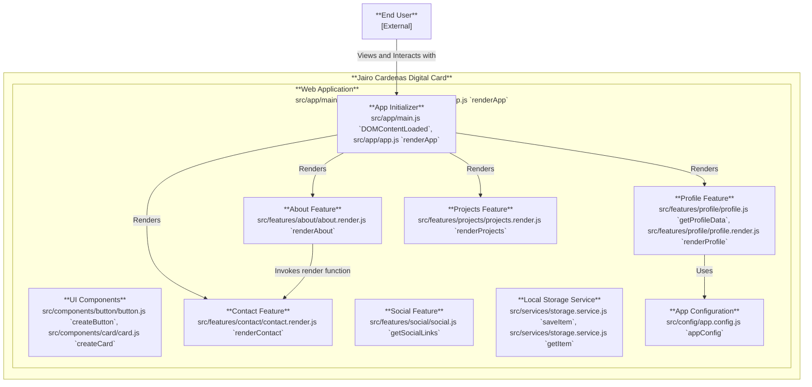

# Unnamed CodeViz Diagram

```mermaid
graph TD

    base.cv::user["**End User**<br>[External]"]
    subgraph base.cv::digitalCard["**Jairo Cardenas Digital Card**<br>index.html `<title>Jairo Cárdenas</title>`"]
        subgraph base.cv::webapp["**Web Application**<br>src/app/main.js `DOMContentLoaded`, src/app/app.js `renderApp`"]
            base.cv::appInitializer["**App Initializer**<br>src/app/main.js `DOMContentLoaded`, src/app/app.js `renderApp`"]
            base.cv::uiComponents["**UI Components**<br>src/components/button/button.js `createButton`, src/components/card/card.js `createCard`"]
            base.cv::aboutFeature["**About Feature**<br>src/features/about/about.render.js `renderAbout`"]
            base.cv::contactFeature["**Contact Feature**<br>src/features/contact/contact.render.js `renderContact`"]
            base.cv::profileFeature["**Profile Feature**<br>src/features/profile/profile.js `getProfileData`, src/features/profile/profile.render.js `renderProfile`"]
            base.cv::projectsFeature["**Projects Feature**<br>src/features/projects/projects.render.js `renderProjects`"]
            base.cv::socialFeature["**Social Feature**<br>src/features/social/social.js `getSocialLinks`"]
            base.cv::localStorageService["**Local Storage Service**<br>src/services/storage.service.js `saveItem`, src/services/storage.service.js `getItem`"]
            base.cv::appConfig["**App Configuration**<br>src/config/app.config.js `appConfig`"]
            %% Edges at this level (grouped by source)
            base.cv::appInitializer["**App Initializer**<br>src/app/main.js `DOMContentLoaded`, src/app/app.js `renderApp`"] -->|"Renders"| base.cv::profileFeature["**Profile Feature**<br>src/features/profile/profile.js `getProfileData`, src/features/profile/profile.render.js `renderProfile`"]
            base.cv::appInitializer["**App Initializer**<br>src/app/main.js `DOMContentLoaded`, src/app/app.js `renderApp`"] -->|"Renders"| base.cv::projectsFeature["**Projects Feature**<br>src/features/projects/projects.render.js `renderProjects`"]
            base.cv::appInitializer["**App Initializer**<br>src/app/main.js `DOMContentLoaded`, src/app/app.js `renderApp`"] -->|"Renders"| base.cv::aboutFeature["**About Feature**<br>src/features/about/about.render.js `renderAbout`"]
            base.cv::appInitializer["**App Initializer**<br>src/app/main.js `DOMContentLoaded`, src/app/app.js `renderApp`"] -->|"Renders"| base.cv::contactFeature["**Contact Feature**<br>src/features/contact/contact.render.js `renderContact`"]
            base.cv::profileFeature["**Profile Feature**<br>src/features/profile/profile.js `getProfileData`, src/features/profile/profile.render.js `renderProfile`"] -->|"Uses"| base.cv::appConfig["**App Configuration**<br>src/config/app.config.js `appConfig`"]
            base.cv::aboutFeature["**About Feature**<br>src/features/about/about.render.js `renderAbout`"] -->|"Invokes render function"| base.cv::contactFeature["**Contact Feature**<br>src/features/contact/contact.render.js `renderContact`"]
        end
    end
    %% Edges at this level (grouped by source)
    base.cv::user["**End User**<br>[External]"] -->|"Views and Interacts with"| base.cv::appInitializer["**App Initializer**<br>src/app/main.js `DOMContentLoaded`, src/app/app.js `renderApp`"]

```
---
*Generated by [CodeViz.ai](https://codeviz.ai) on 29/4/2026, 12:04:06*
